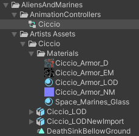
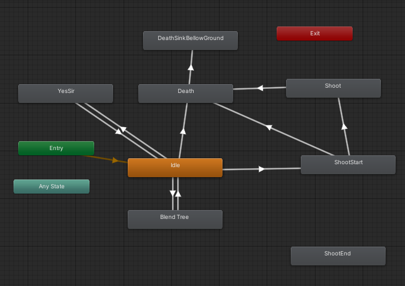
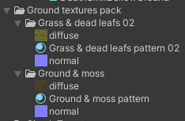
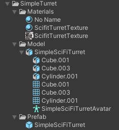

# The bdt0011/Assets/FromStore directory contents

The bdt0011/Assets/FromStore directory has to be created manually. This folder contains free assets from the [Unity asset Store](https://assetstore.unity.com/) that I use to create the game. These assets has to be downloaded manually and added to the game if someone wants to run the project.

These assets are the following.

## Alien and Space Marines Units
The asset store link: https://assetstore.unity.com/packages/3d/alien-and-space-marines-units-36365 .

Only the Ciccio assets are used in this project.
The directory structure should be the following:

The Ciccio animation controller should be modified to look like this:

The Ciccio_LODNewImport.fbx is used in the game which is a reimport of the Ciccio_LOD.fbx asset with Generic Animation Rig. The DeathSinkBellowGround animation clip is created from the last frame of the Death animation clip, and just makes Ciccio sink bellow the ground. These files has to be created manually. And also the materials has to be converted to URP materials.

## Yughues Free Ground Materials
The asset store link: https://assetstore.unity.com/packages/2d/textures-materials/floors/yughues-free-ground-materials-13001 .

Only 2 assets are used from this package: Grass & dead leafs 02 and the Ground & moss. I am only using the textures from this asset in shader graphs.
The directory structure should be the following:

## Simple Sci-Fi Turret
The asset store link: https://assetstore.unity.com/packages/3d/environments/sci-fi/simple-sci-fi-turret-25015 .

The materials has to be converted to URP materials.
The directory structure should be the following:

## Material conversion in Unity
Select the material in the project tab. Then select Edit>Render Pipeline>Universal Render Pipeline>Upgrade selected materials to UniversalRP Materials menu.

